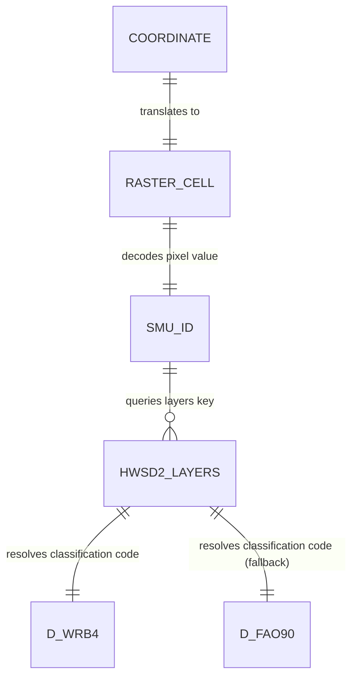
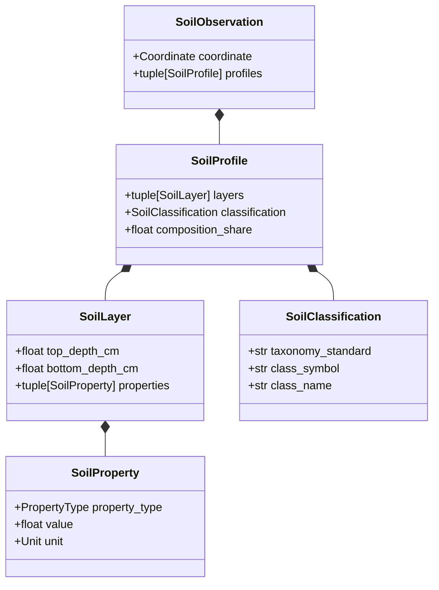

# HWSD Domain Mapping Specification

This document maps the official Harmonized World Soil Database (HWSD) v2.0 schema and tables to the domain model, repository layer, and REST API in the Global Soil Explorer architecture.

## 1. Table Coverage Matrix

| SQLite Table Name | Raw MDB Table Name | Purpose / Scientific Meaning | Relationship | Domain Representation | Exposed in Repository |
| :--- | :--- | :--- | :--- | :--- | :--- |
| `HWSD2_LAYERS` | `HWSD2_LAYERS` | Core layer-wise physical/chemical soil property records (up to 7 layers, D1-D7). | One-to-Many with SMU | `SoilLayer`, `SoilProperty` | Yes (main query target) |
| `HWSD2_SMU` | `HWSD2_SMU` | Summary mapping unit records aggregating dominant values and climate (Koppen-Geiger). | One-to-One / Summary | None (currently bypassed in favor of detail layers) | No |
| `HWSD2_LAYERS_METADATA` | None (Generated) | Technical metadata documenting columns in `HWSD2_LAYERS`. | Metadata | None (used during database generation only) | No |
| `HWSD2_SMU_METADATA` | None (Generated) | Technical metadata documenting columns in `HWSD2_SMU`. | Metadata | None | No |
| `WRB_Class` | `WRB_Class` | Soil Reference Groups classifications with RGB colors for map visualization. | Lookup Reference | `SoilClassification` (label mapping) | Yes (colors not yet exposed) |
| `WRB_Layer` | `WRB_Layer` | GIS raster layer metadata mapping raster files and multipliers. | Lookup Reference | None | No |
| `WRB_Library` | `WRB_Library` | Library info relating dataset versions to master catalog. | Reference Info | None | No |
| `D_ADD_PROP` | `D_ADD_PROP` | Lookup dictionary for additional properties codes. | Lookup | None | No |
| `D_AWC` | `D_AWC` | Lookup dictionary for Available Water Capacity classes. | Lookup | None (exposed as value property) | No |
| `D_COVERAGE` | `D_COVERAGE` | Lookup dictionary for mapping coverage sources. | Lookup | None | No |
| `D_DRAINAGE` | `D_DRAINAGE` | Lookup dictionary for reference drainage classes. | Lookup | None | No |
| `D_FAO90` | `D_FAO90` | Lookup dictionary for FAO 1990 soil unit codes. | Lookup | `SoilClassification` (FAO90 mapping) | Yes |
| `D_IL` | `D_IL` | Lookup dictionary for impermeable layer depth codes. | Lookup | None | No |
| `D_KOPPEN` | `D_KOPPEN` | Lookup dictionary for Koppen-Geiger climate classes. | Lookup | None | No |
| `D_PHASE` | `D_PHASE` | Lookup dictionary for soil phases codes (PHASE1, PHASE2). | Lookup | None | No |
| `D_ROOTS` | `D_ROOTS` | Lookup dictionary for obstacles to roots codes. | Lookup | None | No |
| `D_ROOT_DEPTH` | `D_ROOT_DEPTH` | Lookup dictionary for rootable soil depth codes. | Lookup | None | No |
| `D_SWR` | `D_SWR` | Lookup dictionary for Soil Water Regime codes. | Lookup | None | No |
| `D_TEXTURE` | `D_TEXTURE` | Lookup dictionary for soil texture codes. | Lookup | None (exposed as weight shares) | No |
| `D_TEXTURE_SOTER` | `D_TEXTURE_SOTER` | Lookup dictionary for SOTER texture classes. | Lookup | None | No |
| `D_TEXTURE_USDA` | `D_TEXTURE_USDA` | Lookup dictionary for USDA texture classes. | Lookup | None | No |
| `D_WRB2` | `D_WRB2` | Lookup dictionary for WRB 2nd Edition codes (2-digit). | Lookup | `SoilClassification` (WRB2 mapping) | Yes |
| `D_WRB2code` | `D_WRB2code` | Lookup dictionary for Dominant Soil Group (WRB + phases). | Lookup | None | No |
| `D_WRB4` | `D_WRB4` | Lookup dictionary for WRB 2022 codes (4-digit). | Lookup | `SoilClassification` (WRB4 mapping) | Yes |
| `D_WRB_PHASES` | `D_WRB_PHASES` | Lookup dictionary for WRB 2022 soil unit symbol phases. | Lookup | None | No |

---

## 2. Relationship Diagrams

### Spatial Resolution & Mapping Unit Linkage

### Domain Composition Relationships

---

## 3. Semantic Meaning of Key Relationships

1. **Coordinate to Raster Cell**: Translates continuous geographical coordinates (WGS84 latitude/longitude) to discrete grid indices (col/row offsets) on a 30 arc-second global grid (43200 x 21600 cells).
2. **SMU_ID to `HWSD2_LAYERS`**: A Soil Mapping Unit (SMU) represents a geographical polygon. Because soils are highly heterogeneous, a single SMU (represented by a pixel value in the raster) is composed of multiple distinct soil profiles (sequences), each representing a percentage share of the mapping unit area.
3. **Sequence to `SoilProfile`**: Represents a single soil type within the mapping unit. It vertically stacks physical and chemical layers and holds a specific classification.
4. **`SoilClassification` to Reference Lookups**: Maps classification codes (`WRB4`, `WRB2`, `FAO90`) to standard international scientific classification taxonomy. This enables human-readable names to be associated with technical symbols (e.g. `LV` to `"Luvisols"`).
