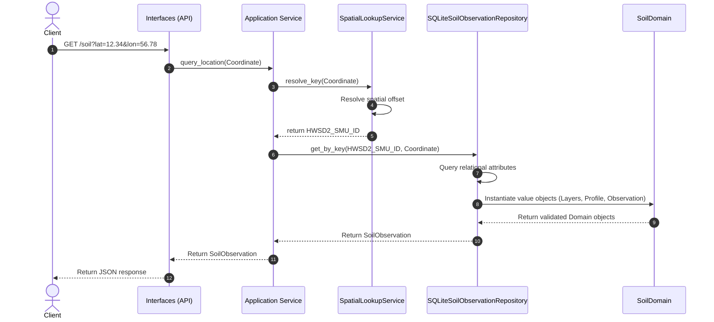

# System Architecture: Global Soil Explorer

---

## Purpose
This document defines the conceptual system architecture of the Global Soil Explorer. It serves as a technology-agnostic structural blueprint mapping out key subsystems, core components, and data flows. By separating logical boundaries from specific databases, servers, and frameworks, this architecture ensures the system remains maintainable, extensible, and stable over time.

---

## Architectural Goals
1.  **Simplicity**: Avoid unnecessary abstraction. Ensure the system components are easy to understand, inspect, and debug.
2.  **Maintainability**: Separate spatial calculations, data storage, and visual presentation so changes to one component do not affect the others.
3.  **Scientific Correctness**: Ensure data integrity and provenance are preserved. The system must represent physical and chemical soil properties exactly as documented in the source datasets.
4.  **Dataset Independence**: Design core domain layers to be independent of any single dataset structure, allowing future datasets to be integrated by returning a standard soil observation.
5.  **Extensibility**: Provide defined extension points to support future features like AI analytics, time-series data, and remote sensing.
6.  **Performance**: Optimize the data flow to ensure near-instantaneous spatial coordinate lookups and profile rendering.
7.  **Reproducibility**: Ensure all preprocessing and database transformation pipelines are scripted, deterministic, and repeatable.

---

## System Overview
The Global Soil Explorer is conceptually divided into three decoupled subsystems:

1.  **Ingestion & Preprocessing Subsystem**: Runs offline. It ingests raw, immutable datasets, runs validation checks, converts tabular database structures, and extracts spatial binary grids to generate runtime assets.
2.  **Core Query & Domain Subsystem**: Runs at runtime. It intercepts coordinate queries, resolves spatial identifiers, retrieves properties, and assembles them into structured, immutable soil observations.
3.  **Presentation Subsystem**: Runs on the client side. It provides an interactive map interface, captures coordinate selections, and visualizes vertical soil profile parameters.

---

## Core Components

### 1. User Interface (Interfaces / presentation)
*   **Purpose**: Provide an interactive graphical dashboard for soil exploration.
*   **Responsibilities**: Render global soil layers, handle map interactions, capture selected coordinates, and display vertical soil profile charts and metadata legends.
*   **Inputs**: Visual map layer data, structured Soil Observation payloads.
*   **Outputs**: Coordinate query coordinates.
*   **What it owns**: Visual layout state, client-side map interactions, charting components.
*   **What it must not own**: Spatial calculations, database queries, dataset dictionaries, and code translation logic.

### 2. Application Layer (Orchestration)
*   **Purpose**: Coordinate request execution and manage the sequence of operations.
*   **Responsibilities**: Receive coordinate queries, trigger the spatial lookup, coordinate database repository queries, and compile domain observations.
*   **Inputs**: Coordinate queries.
*   **Outputs**: Structured Soil Observation objects.
*   **What it owns**: Query orchestration, session flow.
*   **What it must not own**: Raw database connections and UI rendering.

### 3. Spatial Lookup Service
*   **Purpose**: Resolve geographical coordinates to spatial identifiers.
*   **Responsibilities**: Resolves a validated Coordinate into a dataset-specific spatial identifier. **Never queries the database repository**.
*   **Inputs**: Validated coordinates.
*   **Outputs**: Spatial Identifier (opaque token or unit key).
*   **What it owns**: Spatial coordinate resolution logic.
*   **What it must not own**: Soil attribute databases, dictionary translations, and map presentation code.

### 4. Soil Domain Layer
*   **Purpose**: Model the scientific entities and rules of the soil science domain.
*   **Responsibilities**: Structure and validate geographic observations, profiles, layers, classifications, and properties. Provides an immutable business model.
*   **Inputs**: Raw database records and code-translation metadata.
*   **Outputs**: Validated domain objects (e.g., `SoilObservation`).
*   **What it owns**: Soil domain validation logic, vertical profile stacking order, and unit conversions.
*   **What it must not own**: File path routing, SQL query strings, and serialized response formats.

### 5. Repository Layer (Data Access)
*   **Purpose**: Retrieve database attributes and map them to domain models.
*   **Responsibilities**: Retrieves fully constructed SoilObservation domain objects, hides storage implementation details, and maps storage records into domain models. **Never reads spatial raster files**.
*   **Inputs**: Dataset-specific spatial identifier.
*   **Outputs**: Fully constructed domain objects (e.g., `SoilObservation`).
*   **What it owns**: Query structures and domain mapping/construction logic.
*   **What it must not own**: Spatial coordinate lookups and API endpoint routing.

### 6. Offline Dataset Preprocessing Subsystem (Processing)
*   **Purpose**: Transform raw datasets into standardized internal representations. Runs strictly offline.
*   **Responsibilities**: Perform archive extraction (if required), validate raw structures, verify metadata, convert raw databases into query-optimized formats, and generate runtime assets. Does not participate in runtime queries.
*   **Inputs**: Raw read-only datasets and schemas.
*   **Outputs**: Optimized SQLite database and extracted binary raster files.
*   **What it owns**: Archive extraction tools, transformation scripts, and schema migration pipelines.
*   **What it must not own**: Runtime user queries and client presentation state.

---

## Architectural Dependency Structure

To maintain clean boundaries and ensure the domain model remains completely independent of database technologies, network frameworks, and routing packages, we distinguish between compile-time dependencies and runtime request flows.

### 1. Compile-Time Dependency Graph
Dependencies flow strictly inwards toward the Domain core. The Domain depends on nothing, ensuring it remains decoupled and testable:

```text
  Interfaces
      ↓
  Application
      ↓
  Contracts
      ↓
  Domain (Independent Core)
```

*   **Domain**: The independent core of the system containing scientific models and validation logic. **Depends on nothing**.
*   **Contracts**: Defines abstractions and interfaces. **Depends on Domain**.
*   **Infrastructure**: Implements the contracts using concrete database and file-system technologies. **Depends on Contracts and Domain**.
*   **Application**: Orchestrates business request pipelines. **Depends on Contracts and Domain**.
*   **Interfaces**: Exposes API endpoints and triggers application orchestration. **Depends on Application**.

### 2. Runtime Call Flow
During request processing, the call flow runs through the following sequence:

```text
  Interfaces (API Endpoint)
      ↓
  Application (Orchestrator)
      ↓
  Contracts (Interfaces)
      ↓
  Infrastructure (Concrete Database / Raster Access)
```

---

## Runtime Data Assets
The runtime query system relies on a set of generated or pre-packaged files. These assets are prepared during the offline preprocessing phase and remain read-only at runtime:

1.  **Binary Raster (`.bil`)**
    *   **Purpose**: Stores the spatial grid mapping cell coordinates to spatial identifiers.
    *   **Lifecycle**: Extracted from a compressed archive (if distributed compressed) during offline preprocessing. Read directly at runtime.
    *   **Rationale**: Raster pixels remain outside SQLite to preserve efficient spatial lookup and avoid duplicating raster data.
2.  **Header File (`.hdr`)**
    *   **Purpose**: Stores metadata about the binary raster grid (dimensions, cell size, data type, byte order).
    *   **Lifecycle**: Read during preprocessing to validate coordinates and during runtime to calculate pixel offsets.
3.  **Projection File (`.prj`)**
    *   **Purpose**: Defines the Coordinate Reference System (CRS) of the raster grid (WGS 84).
    *   **Lifecycle**: Primarily used during preprocessing and dataset validation. Runtime components assume coordinates are already expressed in the expected CRS.
4.  **SQLite Database**
    *   **Purpose**: Stores relational attribute tables (e.g., layers, property definitions) and translation dictionaries, mapping spatial identifiers to classifications and values.
    *   **Lifecycle**: Generated offline. Queried at runtime.

---

## Runtime Asset Lifecycle

To ensure optimal performance and clarity for developers, the lifecycle of the system's data assets is strictly divided into distinct phases:

### 1. Distribution Phase
*   The raw dataset (such as HWSD v2.0) is typically distributed as a compressed archive containing binary raster grids and relational attribute tables.

### 2. Preprocessing Phase (Offline Pipeline)
*   **Archive Extraction**: If the dataset is distributed compressed, extraction occurs exactly once as part of the offline pipeline.
*   **Asset Ingestion**: Relational attribute tables are converted and migrated into an optimized SQLite database.
*   **No Raster Import**: Raster pixels are **never imported into SQLite** to preserve efficient spatial lookup and avoid duplicating raster data.
*   **Verification**: Row-counts, cell coordinates, and metadata are validated offline to generate runtime-ready assets.

### 3. Query Runtime Phase (Online Server)
*   **Direct Raster Read**: The query engine always operates on the extracted binary raster file, resolving coordinate positions directly from disk for high-performance lookup.
*   **Metadata Reference**: The header and projection files verify spatial boundaries.
*   **Attribute Retrieval**: The SQLite database is used solely to store and query normalized attribute data (layers, properties, taxonomic classifications).

---

## Runtime Lookup Pipeline

The logical architecture of the query pipeline describes abstract components only:

```text
  Coordinate
      ↓
  Application
      ↓
  SpatialLookupService
      ↓
  SoilObservationRepository
      ↓
  Domain Mapping
      ↓
  SoilObservation
```

1.  **Coordinate**: Query begins with a geographic `Coordinate` domain object.
2.  **Application**: Coordinates request execution, invoking the SpatialLookupService and SoilObservationRepository.
3.  **SpatialLookupService**: Resolves the geographical `Coordinate` into a dataset-specific spatial identifier.
4.  **SoilObservationRepository**: Retrieves the raw data associated with the spatial identifier, hiding storage implementation details.
5.  **Domain Mapping**: Processes the raw storage records and maps them into validated domain value objects.
6.  **SoilObservation**: Compiles the mapped domain objects into a single, cohesive, validated `SoilObservation` package.

### Current HWSD Runtime Implementation

For the HWSD v2.0 dataset, the logical pipeline is implemented using a binary raster grid and SQLite:

```text
  Coordinate
      ↓
  SpatialLookupService
      ↓
  HWSD BIL Raster
      ↓
  Spatial Identifier
      ↓
  SQLite Repository
      ↓
  Domain Mapping
      ↓
  SoilObservation
```

---

## Runtime Architecture Specification

This section details the implementation-agnostic behavior, lifecycles, and performance expectations of the query system during active server runtime.

### 1. Runtime Startup Lifecycle
When the backend service starts up, it initializes read-only resources and pre-loads structural metadata:

1.  **Configuration Loading**: The system reads file paths, port bindings, and environment variables.
2.  **Metadata Loading**: The system parses grid boundaries and cell dimensions to initialize spatial calculations.
3.  **Raster Handle Initialization**: The system opens a handle on the binary raster grid. This handle remains open throughout the application lifecycle to support repeated queries.
4.  **SQLite Initialization**: The system opens the database in read-only mode, with resource lifetimes managed by the application process.
5.  **Deferred Application Caching**: Application-level lookup tables are not cached in memory. Instead, the design relies on direct, low-latency random access to disk files and SQLite, which may be automatically accelerated by operating system page caching. Additional caching layers are deferred until profiling dictates a need.

### 2. Runtime Request Lifecycle
A client coordinate request executes through the following isolated sequence:



### 3. Runtime Asset Responsibilities
Each file asset has a specific role mapped across the preprocessing and query stages:

| Asset Name | Preprocessing Stage Usage | Startup Phase Usage | Query Runtime Stage Usage |
| :--- | :--- | :--- | :--- |
| **`HWSD2.bil`** | Extracted from ZIP archive | Opened as read-only handle | Random-access spatial queries |
| **`HWSD2.hdr`** | Validated for consistency | Parsed to load grid dimensions | Used to calculate spatial offsets |
| **`HWSD2.prj`** | Validated against WGS 84 bounds | Unused (assumed correct) | Unused (assumed correct) |
| **`hwsd.db`** | Generated from MDB conversion | Opened in read-only mode | SQL select queries for properties |

### 4. Raster Access Strategy
To support high concurrent request volume without excessive RAM usage:
*   **Application Lifetime Open**: The raster is opened once during initialization and reused throughout the application lifetime.
*   **Random Access Lookup**: The system performs direct, targeted lookup of coordinates, resolving the pixel index and reading only the required bytes from the file.
*   **Decoupled Implementation**: The implementation details of how bytes are resolved are hidden behind the `SpatialLookupService` interface.
*   **Operating System Page Caching**: The application does not load the raster into RAM, relying on the operating system page cache to keep hot segments of the file in memory automatically.

### 5. SQLite Lifecycle
*   **Read-Only Access**: The runtime accesses the SQLite database in strictly read-only mode to prevent write locks and ensure concurrent read safety.
*   **Resource Lifetime**: The application runtime manages database connection lifetimes, ensuring handles are initialized once and cleaned up upon termination.
*   **Decoupled Relational Access**: The repository implementation completely owns and encapsulates SQL database queries and connections.

### 6. Performance Targets (Engineering Targets)
These latency values represent target engineering goals under standard server deployment environments (actual performance varies with hardware and deployment configurations):
*   **Spatial Lookup**: `< 1 ms`
*   **Repository Query**: `< 5 ms`
*   **Domain Mapping**: `< 2 ms`
*   **End-to-End Backend Request**: `< 20 ms`

### 7. Thread Safety
*   **Immutable Structures**: The metadata, parsed bounds, and coordinate variables are immutable at runtime.
*   **Concurrent Read Execution**: Read-only raster file access and database operations are executed concurrently across requests without write lock contention.

### 8. Future Tile Service Separator
To keep analytical lookup queries decoupled from visualization pipelines:
*   **Coordinate Queries**: Resolves exact profiles and properties for a single location (Analytical path).
*   **Map Visualization**: A future tile engine (serving raster or vector map tiles) will serve map graphics along a separate runtime path, entirely bypassing the analytical domain object construction pipeline.

### 9. Deployment Considerations
*   **Server-Side Isolation**: Large assets (`HWSD2.bil` and `hwsd.db`) reside exclusively on the server.
*   **Zero Client Downloads**: The browser client never downloads the raw database or raster files.
*   **API Boundary**: All interactions are restricted to JSON payloads and visual tiles served through API ports.

---

## Runtime Failure Modes
To ensure resilience, the runtime handles typical system and input failures gracefully:

### 1. Spatial Resolution Failures (Out-of-Bounds Queries)
*   **Scenario**: A coordinate is queried that falls outside the geographic boundaries of the global soil grid (e.g. coordinates in open ocean or outside standard latitude/longitude ranges).
*   **Flow**:
    1. `SpatialLookupService` translates the geographic coordinate to grid coordinates and detects it is out of bounds or maps to a `NoData` pixel value.
    2. `SpatialLookupService` returns `None` or a dataset-specific `NoData` sentinel code.
    3. `Application Service` intercepts this result, bypasses the database repository query entirely, and returns a clean, structured "No Observation" result (or raises a coordinate out-of-bounds error).
    4. `Interfaces (API)` returns a `404 Not Found` or empty observation payload.

### 2. Infrastructure Availability Failures (SQLite Offline/Unreachable)
*   **Scenario**: The SQLite database file is missing, corrupt, or locked due to system issues.
*   **Flow**:
    1. `SQLiteSoilObservationRepository` fails to connect or query tables and raises a database execution error.
    2. `Application Service` catches the database error, logs the infrastructure failure, and raises a service availability exception.
    3. `Interfaces (API)` catches the exception and returns an `HTTP 503 Service Unavailable` response to the client.

### 3. Layer Property Omissions (No Measurable Soil Properties)
*   **Scenario**: An SMU contains layers where all physical property values are NULL or missing (such as deeper rocky layers in Leptosols or non-soil surfaces).
*   **Flow**:
    1. `SQLiteSoilObservationRepository` reads database rows and filters out all NULL/missing properties.
    2. The repository compiles the layers with empty `properties` tuples.
    3. `SoilLayer` and `SoilObservation` objects are successfully instantiated (this is structurally valid and expected in the domain model).
    4. **This is not an error**; the API successfully returns the observation and layers with empty properties.

---

## Dataset Independence
*   **Preprocessing is Dataset-Specific**: The offline validation and generation scripts are custom-tailored to the HWSD v2.0 file structures, table naming conventions, and data sentinels.
*   **Runtime Contracts are Dataset-Independent**: The core domain model (`SoilObservation`, `SoilProfile`, etc.) and contracts (`SoilObservationRepository`, `SpatialLookupService`) contain no HWSD-specific naming or structure.
*   **Decoupled Infrastructure**: Only concrete infrastructure implementations know the underlying data source (whether it is HWSD v2.0, SoilGrids, or a different database). The domain remains completely isolated.

---

## Non-Goals
*   **Desktop GIS**: The project is not intended to become a full-featured desktop GIS client (like QGIS or ArcGIS) supporting complex spatial processing, custom map projection editing, or raw geodatabase authorship.
*   **Dataset Editor**: The system is read-only; it is not designed to edit, create, or alter soil inventory values.
*   **Raw Preprocessing Application**: The tool is not a general-purpose converter for raw spatial files outside the scope of target soil datasets.
*   **Replacement for Scientific Databases**: It does not replace the master repositories hosted by institutions (FAO, IIASA, ISRIC) and remains a presentation and discovery tool.

