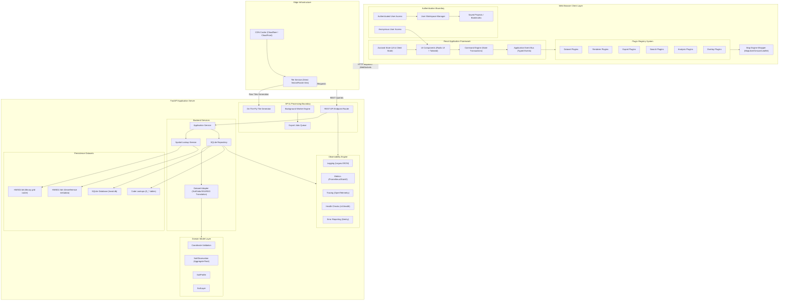
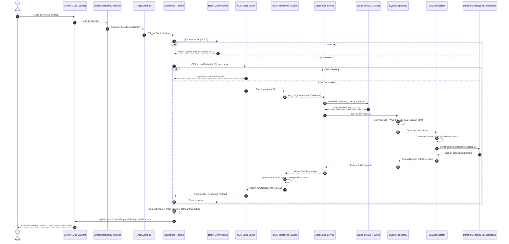
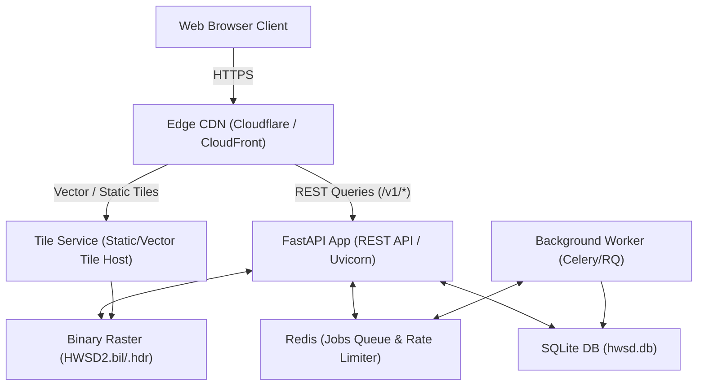
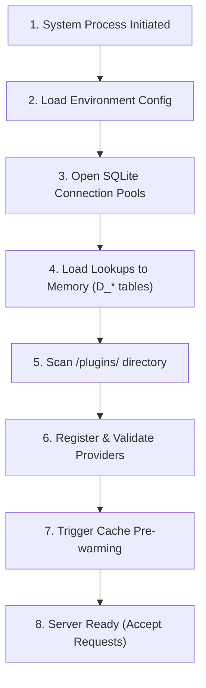
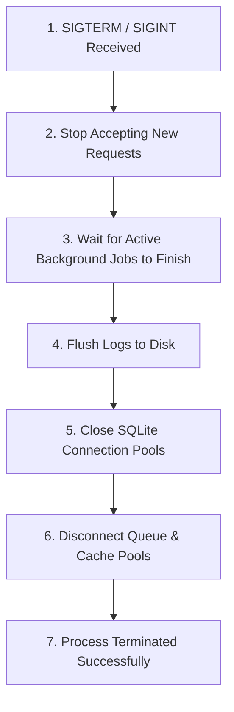

# Global Soil Explorer: System Blueprint

This document serves as the definitive reference blueprint for the entire Global Soil Explorer platform. It consolidates the backend architecture, frontend architecture, pipelines, and caching layers into a single cohesive system layout.

---

## 1. High-Level System Architecture

This diagram illustrates the separation of concerns across the network boundary. It details client-side state, the extensible **Plugin Registry**, the authentication boundary, background workers, and backend observability.

---

## 2. End-to-End Query Sequence Diagram

This sequence diagram traces the complete lifecycle of a map interaction click resolving to a scientific observation query.

---

## 3. Physical Deployment Topology

To ensure high scalability and fast response times, static and vector tiles bypass the main FastAPI application server, routing directly to the dedicated Tile Service.

---

## 4. Cache Hierarchy & Invalidation Policies

The platform maintains a highly efficient 9-tier cache hierarchy to minimize latency:

| Level | Tier | Target Latency | Technology | Invalidation Policy |
| :--- | :--- | :--- | :--- | :--- |
| **L1** | **React State** | < 1ms | Zustand | Reset on coordinate/dataset switch |
| **L2** | **TanStack Query** | < 1ms | In-Memory Cache | Stale-time: 5 minutes; manual refetch triggers |
| **L3** | **Service Worker** | 2 - 10ms | Cache Storage API | Least Recently Used (LRU) - Max 100MB limit |
| **L4** | **Browser HTTP Cache** | 2 - 10ms | Browser Disk | Controlled by Cache-Control headers |
| **L5** | **CDN Cache** | 15 - 50ms | Edge Server | Purge on new dataset release deployment |
| **L6** | **FastAPI Cache** | 5 - 15ms | In-Memory (Redis) | Time-to-Live (TTL): 24 hours |
| **L7** | **SQLite Page Cache** | < 1ms | RAM | Managed by SQLite Engine (PRAGMA cache_size) |
| **L8** | **OS Page Cache** | < 1ms | RAM | Managed by Linux/macOS kernel page buffers |
| **L9** | **Physical Disk** | 1 - 5ms | SSD | Persistence layer - never invalidated |

---

## 5. Segmented Query Pipelines

To scale the query processing paths independently, queries are split into four dedicated pipelines:

### A. Viewport Pipeline (Map tiles)
`User Pan/Zoom` → `Viewport Box Bounding` → `Service Worker Cache` → `CDN Tile Service` → `Map WebGL Rendering`

### B. Coordinate Pipeline (Scientific details)
`Map Click` → `Coord Validation` → `TanStack Cache` → `REST API` → `Dataset Adapter` → `Zustand Store` → `Panel Display`

### C. Search Pipeline (Geocoding)
`Search Bar Text` → `Debounce` → `Geocoder Provider` → `Location Autocomplete` → `Coordinate selected event`

### D. Analysis Pipeline (Spatial analytics)
`Polygon selection` → `Validation` → `Background Queue Worker` → `GeoJSON Export / Statistics Table`

---

## 6. Interface Versioning Matrix

To maintain backward compatibility as the system evolves, every layer interface is explicitly versioned:

*   **REST API**: Versioned via URL path prefixes (e.g., `/v1/soil`). Legacy routes are retained as aliases.
*   **Event Contracts**: Event payload schemas are versioned via the event envelope (e.g., `{ type: 'CoordinateSelected', version: '1.0', payload: { lat, lon } }`).
*   **Plugin API**: The plugin registries validate provider interfaces on registration. Interface upgrades increment the plugin minor version.
*   **Dataset Adapter Interface**: Backend adapters inherit versioned abstract base classes (e.g., `BaseDatasetAdapterV1`).
*   **Export Schema**: Standardized export JSON schemas contain a metadata version string (`schema_version: "1.0"`).
*   **Tile Schema**: MVT vector tile schemas define key names and properties inside standard versioned tile specifications (e.g., `v1/tile/{z}/{x}/{y}.mvt`).

---

## 7. System Lifecycles Diagrams

These diagrams provide a detailed visual overview of operational lifecycles within the Global Soil Explorer.

### A. Application Startup & Plugin Discovery

### B. Graceful Shutdown Sequence

