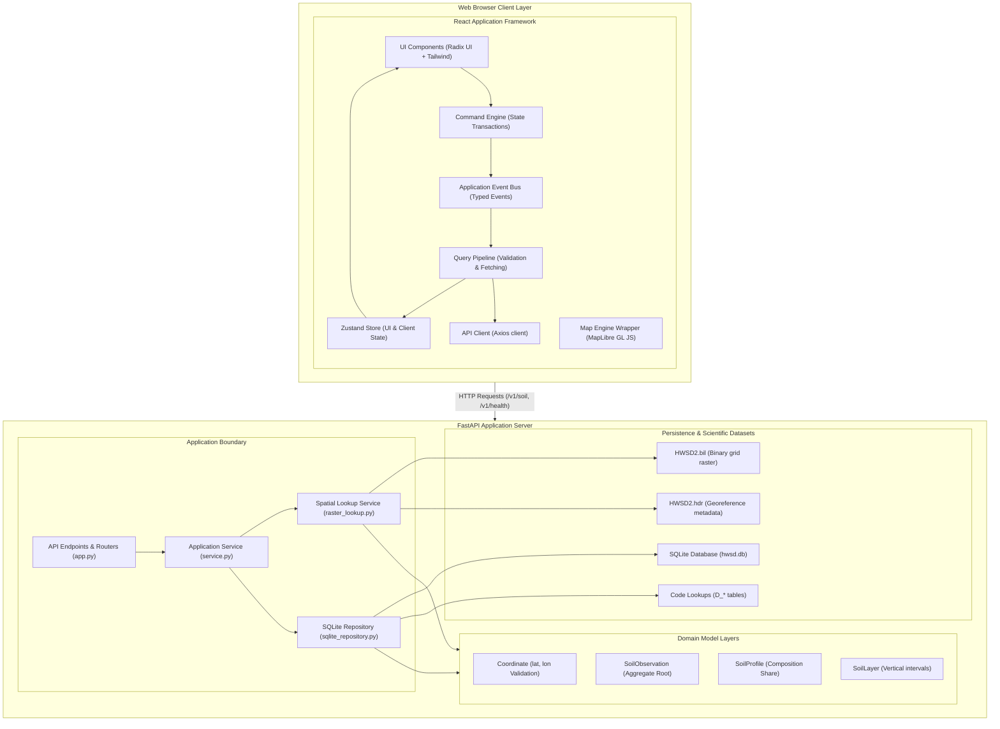
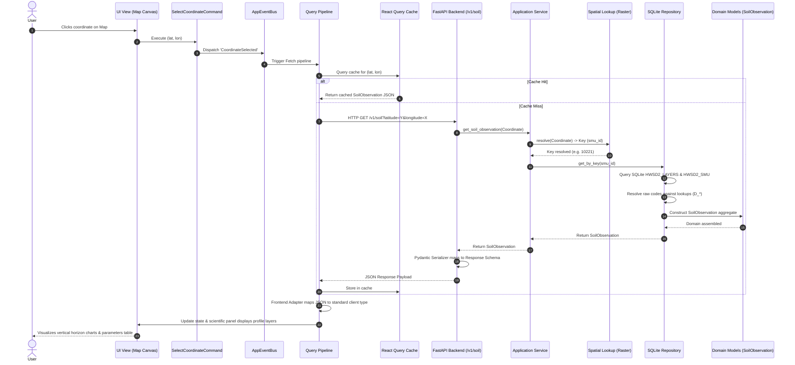
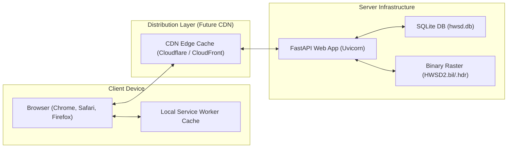

# Global Soil Explorer: System Blueprint

This document serves as the definitive reference blueprint for the entire Global Soil Explorer platform. It consolidates the backend architecture, frontend architecture, pipelines, and caching layers into a single cohesive system layout.

---

## 1. High-Level System Architecture

This diagram illustrates the separation of concerns across the network boundary, isolating client-side state and map rendering from the server-side processing, lookup, and repository databases.



---

## 2. End-to-End Sequence Diagram (Map Click query flow)

This sequence diagram traces a coordinate point query from the initial click down to the data retrieval, domain assembly, serialization, and frontend presentation layers.



---

## 3. Physical Deployment Topology

This diagram maps the current physical deployment boundaries and details how the future Content Delivery Network (CDN) and tile services scale the delivery of raster grids.



---

## 4. Cache Hierarchy & Latency Boundaries

To achieve rapid page load and coordinate lookups, data caches are layered across the entire hardware and networking path:

```
┌────────────────────────────────────────────────────────────────────────┐
│ Client-Side Memory (React State / Zustand)   | Latency: < 1ms          │
└──────────────────────────────────┬─────────────────────────────────────┘
                                   ▼
┌────────────────────────────────────────────────────────────────────────┐
│ Client-Side Cache (React Query In-Memory)    | Latency: < 1ms          │
└──────────────────────────────────┬─────────────────────────────────────┘
                                   ▼
┌────────────────────────────────────────────────────────────────────────┐
│ Browser Cache (Service Worker Cache Storage) | Latency: 2 - 10ms       │
└──────────────────────────────────┬─────────────────────────────────────┘
                                   ▼
┌────────────────────────────────────────────────────────────────────────┐
│ Edge Cache (CDN / HTTP Cache Headers)        | Latency: 15 - 50ms      │
└──────────────────────────────────┬─────────────────────────────────────┘
                                   ▼
┌────────────────────────────────────────────────────────────────────────┐
│ Web App Server (FastAPI Endpoint)            | Latency: 5 - 15ms       │
└──────────────────────────────────┬─────────────────────────────────────┘
                                   ▼
┌────────────────────────────────────────────────────────────────────────┐
│ OS Page Cache (SQLite / Raster binary reads)  | Latency: < 1ms (RAM)    │
└──────────────────────────────────┬─────────────────────────────────────┘
                                   ▼
┌────────────────────────────────────────────────────────────────────────┐
│ Physical Disk Storage (SSD SQLite / Raster)  | Latency: 1 - 5ms (I/O)  │
└────────────────────────────────────────────────────────────────────────┘
```

---

## 5. Complete Query Pipeline Lifecycle

This flowchart defines the end-to-end processing steps, transformations, and data models of a coordinate query lifecycle:

```
[ User Interaction ] ──► (Map canvas selection or search input)
        │
        ▼
[ Command Execution ] ──► (Create Command instance to track state change)
        │
        ▼
[ Event Dispatched ] ──► (Command dispatches Event to application bus)
        │
        ▼
[ Query Builder ] ──► (Query pipeline compiles latitude, longitude, and active filters)
        │
        ▼
[ Client Validation ] ──► (Coordinates range validated; bad values blocked)
        │
        ▼
[ Cache Resolution ] ──► (Checks React Query for matching coordinates cache)
        │
        ▼
[ REST HTTP Client ] ──► (Pushes request to API with AbortController)
        │
        ▼
[ FastAPI App Routing ] ──► (Receives request, validates types, injects services)
        │
        ▼
[ Application Service ] ──► (Orchestrates coordinate seeks across spatial lookup & repository)
        │
        ▼
[ Spatial Lookup ] ──► (Seeks binary bil raster index for coordinate offsets)
        │
        ▼
[ SQLite Repository ] ──► (Fetches layers, maps taxonomy codes, resolves descriptors)
        │
        ▼
[ Domain Construction ] ──► (Builds domain models enforcing invariants)
        │
        ▼
[ API Serializer ] ──► (Pydantic schema validation, filters codes, builds response JSON)
        │
        ▼
[ Frontend Adapter ] ──► (Transforms API JSON into stable unified interface)
        │
        ▼
[ Store Update ] ──► (Updates Zustand store variables, triggers component render)
        │
        ▼
[ Scientific Panel ] ──► (Vertical horizon charts and chemical tables render details)
```
