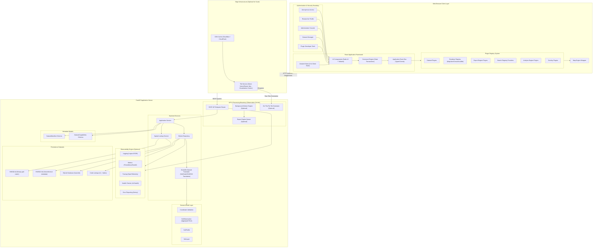
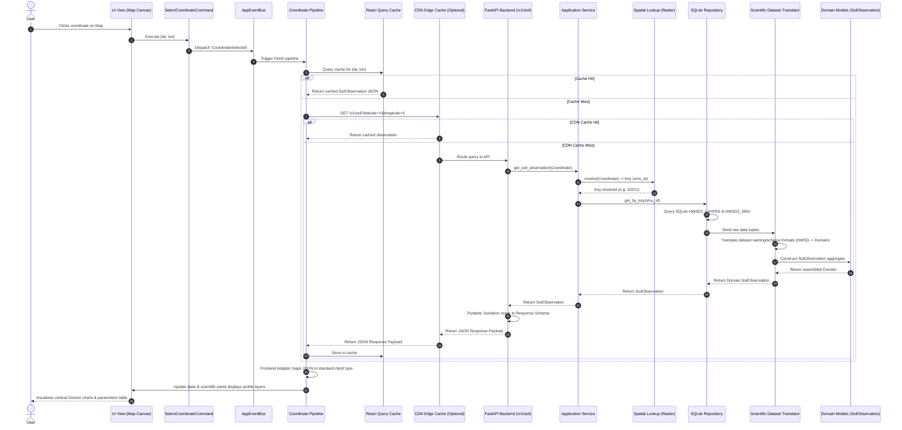
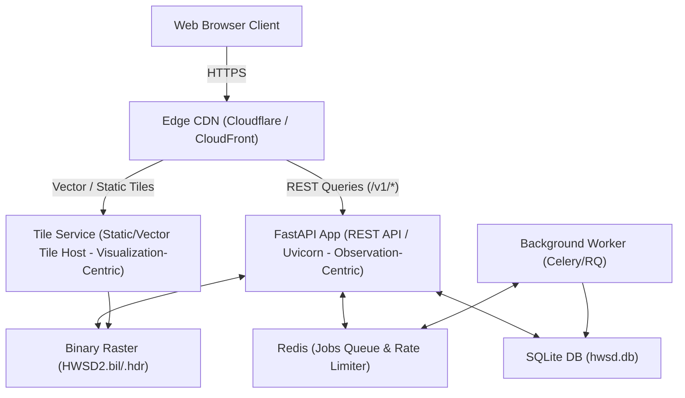
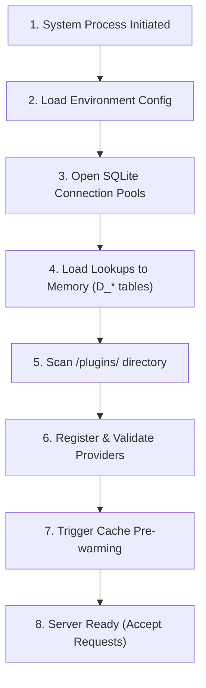
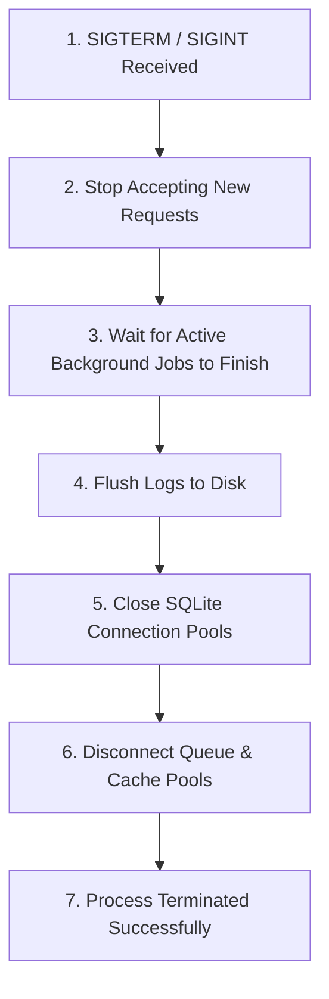

# Global Soil Explorer: System Blueprint

This document serves as the definitive reference blueprint for the entire Global Soil Explorer platform. It consolidates the backend architecture, frontend architecture, pipelines, and caching layers into a single cohesive system layout.

---

## 1. High-Level System Architecture

This diagram illustrates the separation of concerns across the network boundary. It details client-side state, the extensible **Plugin Registry**, the authentication boundary, background workers, and backend observability.



---

## 2. End-to-End Query Sequence Diagram

This sequence diagram traces the complete lifecycle of a map interaction click resolving to a scientific observation query.



---

## 3. Physical Deployment Topology & Decoupling

The platform architecture enforces strict operational and structural decoupling between queries and visualizations:
1.  **Scientific API (Observation-Centric)**: Handles precision location queries, profile assembly, and metadata attribution. Built on FastAPI and SQLite, it prioritizes analytical completeness.
2.  **Tile Service (Visualization-Centric)**: Serves map tile protocols (raster/vector) for rendering geographical bounds. It is optimized for high-throughput map redraw cycles and relies heavily on CDN caches.
3.  **Decoupling Rule**: The observation pipeline and tile render pipeline must remain physically and logically separated. They must never be coupled or share in-memory dependencies.



### A. Infrastructure Dependency Classification

*   **Required Infrastructure (Local Run)**:
    *   **FastAPI**: Server framework hosting the scientific API endpoints.
    *   **SQLite**: Databases layer housing attribute lookups and mapping layers data.
    *   **Raster Files (`.bil` / `.hdr`)**: Georeferenced cell rasters holding spatial indices.
*   **Optional Infrastructure (Production Scaling)**:
    *   **CDN (Content Delivery Network)**: Caches static tile files and REST queries close to users.
    *   **Tile Service (Tile Server)**: Serves map tile protocols directly.
    *   **Redis**: Key-value data cache and background task broker.
    *   **Celery / RQ**: Asynchronous background workers managing long-running jobs (e.g. dynamic reports generation, bulk spatial clips).
    *   **Sentry / Prometheus**: Server observability, logging, and error tracking metrics.

---

## 4. Cache Hierarchy & Invalidation Policies

The platform maintains a highly efficient 9-tier cache hierarchy to minimize latency:

| Level | Tier | Target Latency | Technology | Invalidation Policy |
| :--- | :--- | :--- | :--- | :--- |
| **L1** | **React State** | < 1ms | Zustand | Reset on coordinate/dataset switch |
| **L2** | **TanStack Query** | < 1ms | In-Memory Cache | Stale-time: 5 minutes; manual refetch triggers |
| **L3** | **Service Worker** | 2 - 10ms | Cache Storage API | Least Recently Used (LRU) - Max 100MB limit |
| **L4** | **Browser HTTP Cache** | 2 - 10ms | Browser Disk | Controlled by Cache-Control headers |
| **L5** | **CDN Cache (Optional)** | 15 - 50ms | Edge Server | Purge on new dataset release deployment |
| **L6** | **FastAPI Cache (Optional)** | 5 - 15ms | In-Memory (Redis) | Time-to-Live (TTL): 24 hours |
| **L7** | **SQLite Page Cache** | < 1ms | RAM | Managed by SQLite Engine (PRAGMA cache_size) |
| **L8** | **OS Page Cache** | < 1ms | RAM | Managed by Linux/macOS kernel page buffers |
| **L9** | **Physical Disk** | 1 - 5ms | SSD | Persistence layer - never invalidated |

---

## 5. Segmented Query Pipelines

To scale the query processing paths independently, queries are split into four dedicated pipelines:

### A. Viewport Pipeline (Map tiles)
`User Pan/Zoom` → `Viewport Box Bounding` → `Service Worker Cache` → `CDN Tile Service` → `Map WebGL Rendering`

### B. Coordinate Pipeline (Scientific details)
`Map Click` → `Coord Validation` → `TanStack Cache` → `REST API` → `Scientific Dataset Translator` → `Zustand Store` → `Panel Display`

### C. Search Pipeline (Geocoding)
`Search Bar Text` → `Debounce` → `Geocoder Provider` → `Location Autocomplete` → `Coordinate selected event`

### D. Analysis Pipeline (Spatial analytics)
`Polygon selection` → `Validation` → `Background Queue Worker` → `GeoJSON Export / Statistics Table`

---

## 6. Interface Versioning Matrix

To maintain backward compatibility as the system evolves, every layer interface is explicitly versioned:

*   **REST API**: Versioned via URL path prefixes (e.g., `/v1/soil`). Legacy routes are retained as aliases.
*   **Event Contracts**: Event payload schemas are versioned via the event envelope (e.g., `{ type: 'CoordinateSelected', version: '1.0', payload: { lat, lon } }`).
*   **Plugin API**: The plugin registries validate provider interfaces on registration. Interface upgrades increment the plugin minor version.
*   **Scientific Dataset Translator Interface**: Backend adapters inherit versioned abstract base classes (e.g., `BaseDatasetAdapterV1`).
*   **Export Schema**: Standardized export JSON schemas contain a metadata version string (`schema_version: "1.0"`).
*   **Tile Schema**: MVT vector tile schemas define key names and properties inside standard versioned tile specifications (e.g., `v1/tile/{z}/{x}/{y}.mvt`).

---

## 7. System Lifecycles Diagrams

These diagrams provide a detailed visual overview of operational lifecycles within the Global Soil Explorer.

### A. Application Startup & Plugin Discovery


### B. Graceful Shutdown Sequence


---

## 8. First-Class Study Area Abstractions

To ensure study areas are driven completely by configuration data rather than hardcoded client logic, we establish a standardized metadata schema representing an active **StudyArea** entity.

Eventually, the backend should expose this entity via standard endpoint controllers:
*   `GET /v1/study-areas` (Returns list of active configured study areas)
*   `GET /v1/study-areas/{id}` (Returns detailed metadata, coordinates bounds, projection details, and capability mappings)

### A. StudyArea Data Schema
```typescript
interface StudyArea {
  id: string;                         // Unique study area identifier (e.g., "europe_central")
  name: string;                       // Localized descriptive name (e.g., "Central Europe Grid")
  projection: string;                 // EPSG code or proj4 coordinate system definition
  bounds: [[number, number], [number, number]]; // Bounding box limits (SW, NE lat/lon coordinates)
  availableDatasets: string[];        // Active datasets registered in this area (e.g., ["hwsd_v2"])
  defaultZoom: number;                // Starting map zoom level (e.g., 6.0)
  maxZoom: number;                    // Maximum allowed map detail level
  availableBasemaps: string[];        // List of basemap IDs registered
  tileEndpoint: string;               // URL pattern of the vector/raster tile service
  apiEndpoint: string;                // Base URL pattern for observations queries
  plugins: string[];                  // Analysis/Search plugin IDs enabled for this study area
  capabilities: DatasetCapabilities;  // Consolidated active capabilities constraints
}
```

By registering different `StudyArea` records (e.g. `India`, `Australia`, `Custom Grid`), the entire client map bounds, geocoders, and available data tabs adapt automatically without custom code.

---

## 9. Map Render Layer Stack

To prevent z-ordering layout collisions (where overlay polygons cover label text, or query selections slide underneath the terrain layer), Map Engine implementations must strictly adhere to the following layer render order stack:

```
┌────────────────────────────────────────────────────────┐
│ UI Overlays (Scale bars, Crosshairs, Legends)         │ ◄ Top Layer (Interactive overlay)
├────────────────────────────────────────────────────────┤
│ Labels & Typography (Place names, Road shields)        │
├────────────────────────────────────────────────────────┤
│ Query Markers & Pins (Search results, Click location)  │
├────────────────────────────────────────────────────────┤
│ Active Measurements (Drawn ruler distances, shapes)    │
├────────────────────────────────────────────────────────┤
│ Selection Outlines (Highlighted active soil SMU)      │
├────────────────────────────────────────────────────────┤
│ Scientific Overlays (MVT Polygons / Raster soils)      │
├────────────────────────────────────────────────────────┤
│ Topographic Terrain Relief (Hillshading, Contours)     │
├────────────────────────────────────────────────────────┤
│ Administrative Boundaries (Country / State borders)    │
├────────────────────────────────────────────────────────┤
│ Base Map Vector (Land mass, Water bodies fill)         │ ◄ Bottom Layer (Background)
└────────────────────────────────────────────────────────┘
```

---

## 10. Information Panel & Export Engine Architecture

Because this platform centers primarily around **Scientific Observations**, the `ScientificInfoPanel` has a specialized, componentized layout hierarchy mapping to the scientific aggregate outputs. Exporting is handled via a dedicated **Export Engine**:

```
┌────────────────────────────────────────────────────────┐
│                   Information Panel                    │
├────────────────────────────────────────────────────────┤
│  Summary Section (Coord, Weather, Koppen Climate)      │
├────────────────────────────────────────────────────────┤
│  Profile Tabs selector (Dominant share percentage)     │
├────────────────────────────────────────────────────────┤
│  Layout Grid:                                          │
│  ┌─────────────────────────┬────────────────────────┐  │
│  │  Vertical Horizon Chart │ Measurements Tables    │  │
│  │  (Depth vs Properties)  │ ├── Physical properties│  │
│  │                         │ ├── Chemical parameters│  │
│  │                         │ └── Hydraulic stats    │  │
│  └─────────────────────────┴────────────────────────┘  │
├────────────────────────────────────────────────────────┤
│  Context Card:                                         │
│  ├── Hydrologic context descriptions                   │
│  └── Land limitations growth modifiers                 │
├────────────────────────────────────────────────────────┤
│  Metadata & Provenance attribution card                │
├────────────────────────────────────────────────────────┤
│  Related Datasets recommendation links                 │
├────────────────────────────────────────────────────────┤
│  Export Engine Panel (CSV, JSON, GeoJSON, PDF, PNG)   │
└────────────────────────────────────────────────────────┘
```

### A. Export Engine Layout
The **Export Engine** exposes plugin-driven writers. Adding formats (e.g. `TIFF`, `Excel`) is managed via registration in the Export Registry:
```typescript
interface ExportEngine {
  registerProvider(format: string, provider: ExportProvider): void;
  executeExport(format: string, data: SoilObservation): Promise<ExportResult>;
}
```

### B. Analysis Engine
The **Analysis Engine** manages client and server spatial analysis operations, preventing script clutter:
*   *Spatial Statistics*: Area calculations, averages.
*   *Sampling*: Point queries extraction.
*   *Raster Analysis*: Dynamic cell comparisons.
*   *Profile Comparison*: Overlaying two profiles vertically.
*   *Cross Sections*: Drawing a 2D line and generating soil depth profiles along the path.
*   *Reports*: Generating summaries.

---

## 11. Search Registry Architecture

To match the extensibility of the core Plugin Registry, search providers are managed by a central **Search Registry**:

```typescript
interface SearchResultItem {
  id: string;
  label: string;
  category: 'coordinate' | 'location' | 'scientific_attribute' | 'dataset' | 'bookmark' | 'history';
  coordinate: { lat: number; lon: number };
  score: number;
  metadata?: Record<string, any>;
}

interface SearchProvider {
  id: string;
  name: string;
  search(query: string, bounds?: [[number, number], [number, number]]): Promise<SearchResultItem[]>;
}

class SearchRegistry extends ExtensionRegistry<string, SearchProvider> {}
```

The standard search provider implementations register dynamically:
*   `CoordinateSearchProvider`: Parses decimal/DMS coordinates.
*   `LocationSearchProvider` (Geocoder): Queries external Nominatim/Mapbox APIs.
*   `ScientificAttributeSearchProvider`: Scans taxonomies (e.g. "Luvisols").
*   `DatasetSearchProvider`: Searches active map layers.
*   `BookmarkSearchProvider`: Checks user's annotated bookmarks.
*   `HistorySearchProvider`: Searches locally saved search queries.

---

## 12. Internationalization (i18n) Strategy

To support multi-language localizations in the field while maintaining scientific and scientific-database reproducibility:
1.  **Stable Scientific Names**: Scientific constants (e.g. taxonomy designations like `Luvisols`, soil codes like `LVcr`, standard measurement keys like `organic_carbon`) remain **strictly untranslated** in database cells and API JSON files.
2.  **UI Label Localization**: User-facing labels, field descriptors, and menus are localized using an i18n framework (e.g. `react-i18next`). UI keys map to translatable translation files:
    *   `measurements.chemical.ph_water` → `"pH (Water)"` (EN) / `"pH (Eau)"` (FR)
    *   `limitations.root_depth_description` → `"Root depth accessibility"` (EN) / `"Accessibilité de la profondeur des racines"` (FR)

---

## 13. Styling Theme Abstractions

To simplify dark mode, accessibility high-contrast rules, and map readability overlays, styling tokens are structured into four segregated theme abstraction layers:

```
┌────────────────────────────────────────────────────────┐
│                   Theme Configuration                  │
├────────────────────────────────────────────────────────┤
│  Application Theme (Tailwind HSL colors, dark mode)    │
├────────────────────────────────────────────────────────┤
│  Map Theme (MapLibre vector styling rules, roads fill) │
├────────────────────────────────────────────────────────┤
│  Scientific Theme (Soil colors, texture colors)        │
├────────────────────────────────────────────────────────┤
│  Accessibility Theme (Colorblind options, large text) │
└────────────────────────────────────────────────────────┘
```

---

## 14. Offline Fieldwork Capabilities

To support field surveys where network coverage is absent, the system defines four operational offline stages:

```
[ Stage 1: Online ] (Full connection; network fetches and real-time CDN tile downloads)
        │
        ▼
[ Stage 2: Offline Available ] (Service Worker cache pre-warmed for designated study areas)
        │
        ▼
[ Stage 3: Offline Read Only ] (REST requests resolved from LocalStorage; cached map tiles rendered)
        │
        ▼
[ Stage 4: Offline Analysis ] (Local Turf.js spatial clip operations; geojson file export)
```

---

## 15. Role-Based Authorization Model

Security configurations enforce a strict client-side role hierarchy to govern access to workspace editing tools and database management screens:

| Access Role | Privileges | Target UI Access Controls |
| :--- | :--- | :--- |
| **`Anonymous`** | Read-only coordinate queries, view overlays | View map, read info panel details |
| **`Researcher`**| Anonymous + Save Projects, bookmark coordinate queries | Unlock Saved Projects tabs, write annotations |
| **`Dataset Manager`** | Researcher + Upload datasets, update metadata lookups | Access data manager control panel screens |
| **`Plugin Developer`**| Researcher + Register custom providers, inspect metrics | Access developer plugin register tab, inspect logs |
| **`Administrator`** | All permissions (Full system override access) | Unlock full application config console panel |

---

## 16. Scientific Observation Lifecycle Diagram

This lifecycle flowchart represents the central operational sequence of the entire Global Soil Explorer platform. Every spatial query, visualization, and export follows this path:

```
[ Step 1: Coordinate Trigger ] (Map click / Coordinate search / GPS locator)
            │
            ▼
[ Step 2: Validation Layer ] (Verify coordinate format, bounding bounds check)
            │
            ▼
[ Step 3: Spatial Resolution ] (Seek georeferenced bil raster to extract SMU index key)
            │
            ▼
[ Step 4: Dataset Translation ] (Scientific Dataset Translator maps raw values to standard domains)
            │
            ▼
[ Step 5: Domain Construction ] (Assemble SoilObservation aggregate root, enforce invariants)
            │
            ▼
[ Step 6: API Serialization ] (Filter internal keys; serialize schemas to clean scientific JSON)
            │
            ▼
[ Step 7: Frontend Mapping ] (Adapter matches REST JSON payload to standardized client-side interfaces)
            │
            ▼
[ Step 8: Scientific Display ] (Zustand updates; Recharts displays vertical depth profiles)
            │
            ▼
[ Step 9: Export / Analysis ] (Trigger PDF report compile, GeoJSON export, or Turf clip query)
```

---

## 17. Dataset Manifest & Capabilities Model

Rather than scattering dataset configurations across various static files, every registered database is backed by a unified **DatasetManifest** model. This is combined with the **DatasetCapabilities** model to drive the UI dynamically.

### A. DatasetManifest Schema (Metadata Backbone)
```typescript
interface DatasetManifest {
  id: string;                         // Unique dataset code (e.g., "hwsd_v2")
  name: string;                       // Clean scientific dataset name
  version: string;                    // Release version identifier
  provider: string;                   // Institution responsible for dataset
  license: string;                    // Data usage rights (e.g. "CC-BY-4.0")
  citation: string;                   // Academic citation standard string
  projection: string;                 // Source raster georeference projection
  coverage: string;                   // Geographic bounds description
  resolution: string;                 // Cell resolution (e.g., "30 arc-seconds")
  depthIntervals: { top: number; bottom: number }[]; // Supported layer slices
  availableProperties: string[];      // Chemical / physical property columns available
  availableLayers: string[];          // List of map overlay layers generated
  lastUpdated: string;                // UTC timestamp of persistence generation
  supportedExports: string[];         // Export formats validated
  colorScheme: Record<string, string>; // Colors mappings for taxonomy renders
  studyAreas: string[];               // Associated Study Area configuration IDs
}
```

### B. DatasetCapabilities Model (Shared Backend & Frontend Model)
Both the backend REST API responses and frontend stores use this model to identify which queries are supported:
```typescript
interface DatasetCapabilities {
  supportsProfiles: boolean;       // Resolves to multiple component profile structures?
  supportsLayers: boolean;         // Supports distinct soil layer depths?
  supportsTexture: boolean;        // Renders USDA/SOTER texture classifications?
  supportsChemistry: boolean;      // Renders chemical measurement ranges?
  supportsHydrology: boolean;      // Renders drainage/impermeable layer context?
  supportsRaster: boolean;         // Has raster overlay layers?
  supportsVectorTiles: boolean;    // Has vector overlay layers?
  supportsOffline: boolean;        // Validated for local cache fieldwork queries?
  supportsSearch: boolean;         // Has searchable taxonomic attributes?
  supportsExport: boolean;         // Can export observation records?
}
```

### C. Renderer Capabilities Model
The frontend Renderer Registry queries this model to select the appropriate engine (MapLibre, Cesium, Leaflet, OpenLayers) dynamically:
```typescript
interface RendererCapabilities {
  supportsVectorTiles: boolean;
  supportsRaster: boolean;
  supports3D: boolean;
  supportsTerrain: boolean;
  supportsOffline: boolean;
  supportsOpacity: boolean;
  supportsAnimation: boolean;
}
```
