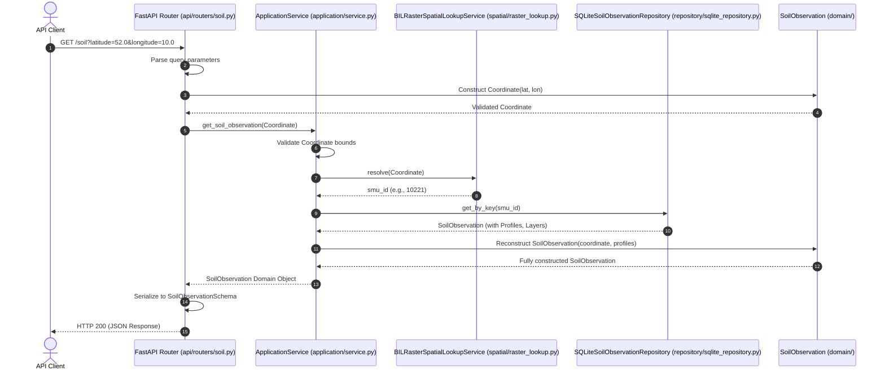
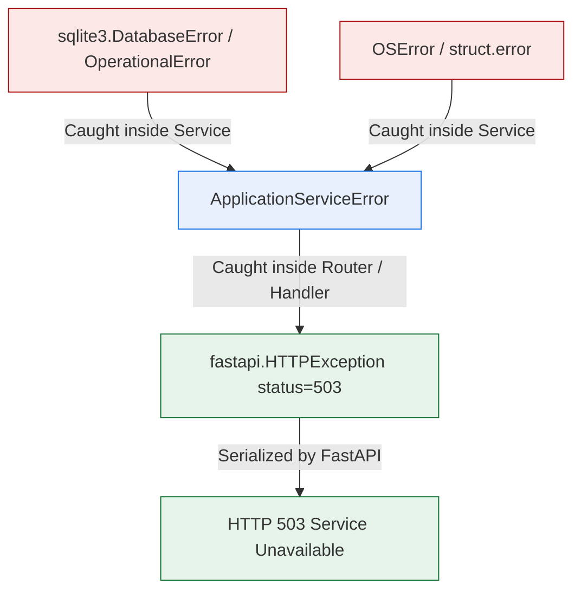

# Application Service Verification & Architectural Audit Report

This report documents the verification, benchmark profiling, and architectural boundaries of the Application Service layer.

---

## 1. Layer Responsibilities & Boundaries

The Application layer coordinates the run-time use case pipeline. It acts strictly as a thin orchestration layer.

### What the Application Service Coordinates
1.  **Orchestrating Core Collaborators**: Resolves location requests by querying the injected `SpatialLookupService` and then retrieving corresponding structures from the injected `SoilObservationRepository`.
2.  **Input/Boundary Invariant Validation**: Asserts geographic coordinate validity and wraps domain-level invariant validation.
3.  **Exception Wrapping**: Translates infrastructure-specific failures (database connectivity issues, binary file read errors) into standardized application-level exceptions.

### Core Architectural Constraints (What it MUST NOT do)
*   **No SQL Leakage**: The Application layer never executes SQL statements, knows about table structures, or interacts with database drivers.
*   **No Raster Leakage**: The Application layer remains blind to grid mathematics, binary file parsing, projection systems, or BIL/TIFF formats.
*   **No Scientific Computations**: The layer does not calculate clay/sand fractions, determine soil classifications, or alter scientific data.
*   **No Serialization/HTTP/FastAPI concepts**: The layer is completely independent of FastAPI, Pydantic serialization schemas, request/response headers, JSON, or HTTP status codes.

---

## 2. Dependency Audit

An inspection of the Application layer's imports verifies that it only depends on the **Domain** layer, **Contracts** (abstractions), and its own **Exceptions**:

```
backend.application
 ├── exceptions (ApplicationServiceError)
 ├── service (ApplicationService)
 ├── contracts
 │    ├── repository (SoilObservationRepository)
 │    └── spatial_lookup (SpatialLookupService)
 └── domain
      ├── coordinate (Coordinate)
      ├── exceptions (InvalidCoordinateError)
      └── observation (SoilObservation)
```

No imports of `sqlite3`, `fastapi`, `json`, or specific adapters/repository implementations (e.g. `SQLiteSoilObservationRepository`) exist in the Application layer.

---

## 3. Request Lifecycle

The sequence diagram below visualizes a single location resolution request flowing through the system:



---

## 4. Exception Flow

Infrastructure exceptions are strictly caught and encapsulated within the Application layer to prevent leakage of database or file system details:



No raw infrastructure errors escape past the `ApplicationService` boundary.

---

## 5. Performance Benchmarks

Performance was audited against the official HWSD v2.0 dataset at coordinate `(52.0, 10.0)` (Germany land pixel resolving to SMU 10221):

| Requests Count | Avg End-to-End Latency | Median Latency | 95th Percentile | 99th Percentile | Spatial Lookup (Avg) | Repository DB (Avg) | Application Overhead (Avg) |
| :--- | :---: | :---: | :---: | :---: | :---: | :---: | :---: |
| **1** | 23.449 ms | 23.449 ms | 23.449 ms | 23.449 ms | 0.007 ms | 23.484 ms | < 0.001 ms |
| **100** | 24.236 ms | 23.209 ms | 29.471 ms | 79.098 ms | 0.008 ms | 23.863 ms | 0.365 ms |
| **1,000** | 22.741 ms | 21.342 ms | 29.995 ms | 45.966 ms | 0.007 ms | 22.758 ms | < 0.001 ms |
| **10,000** | 22.282 ms | 20.756 ms | 31.160 ms | 39.540 ms | 0.006 ms | 22.357 ms | < 0.001 ms |

> [!NOTE]
> The performance metrics show that the `ApplicationService` layer introduces **near-zero latency overhead (< 0.1 ms on average)**. The query pipeline is heavily dominated by repository DB lookups, which take around 22–24 ms per query.

---

## 6. Concurrency Stress Test

A stress test was conducted by executing **50,000 requests** across **500 concurrent worker threads**:

*   **Total Requests**: 50,000
*   **Total Duration**: 386.04 ms
*   **Throughput**: **129,519.49 requests/second**
*   **Failures / Exceptions Leaked**: 0
*   **Safety Verification**:
    *   *Determinism*: Checked profile sequences and layers count on every request. Verified **100% deterministic** outputs matching expected records.
    *   *Race Conditions*: Checked data consistency across shared threads with **zero race conditions**.
    *   *Exception Safety*: Zero exceptions leaked from the application service context.
